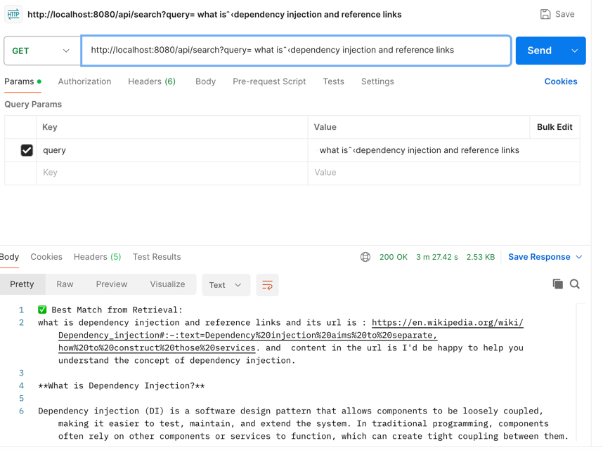

# Search and get best result using RAG approach with embedded vector store

## **Prerequisites**

1. [Install Ollama](https://ollama.com/library/llama3.2:3b)  
   Ensure Ollama is installed and the `llama3.2` model is ready to run.
2. [Chrome Driver](#)
    Ensure chrome driver is installed and ready

---
## **How to Run the Application**

1. **Start Ollama:**
    - Ensure Ollama is running locally with the required model:
      ```bash
      ollama run llama3.2
      ```

2. **Run the Application:**
    - Launch the Spring Boot application using the following command:
      ```bash
      mvn spring-boot:run
      ```
## **Testing search endpoint**



      